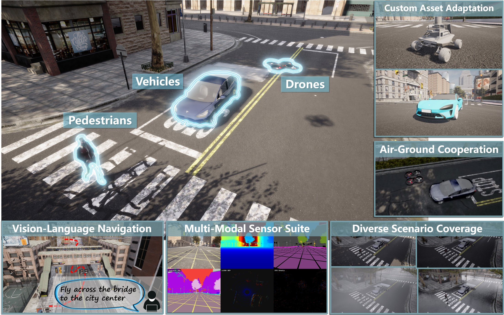
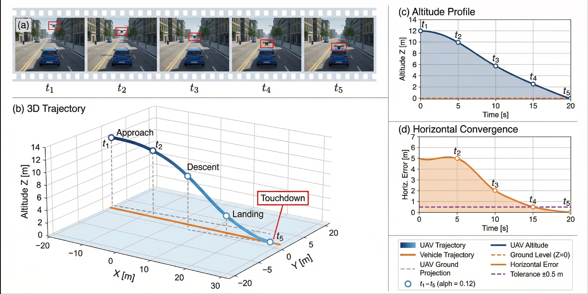
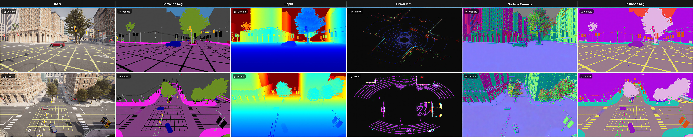
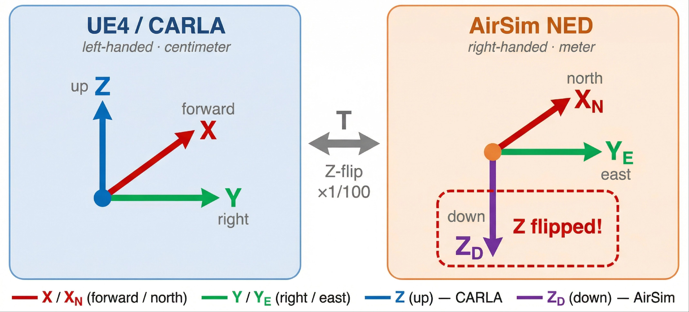

# Anonymous Code Supplement

<p align="center">
  
</p>

This repository contains the code accompanying our NeurIPS 2026 submission on
closed-loop air-ground cooperative VLA evaluation. It has two parts:

- **`platform/`** — the CarlaAir runtime: the single-process integration of
  CARLA and AirSim described in §3 / Appendix B of the paper. Includes the
  unified launcher, AirSim plugin configuration, the three modified upstream
  files that compose the AirSim flight subsystem into CARLA's GameMode, and a
  small set of demo scripts that exercise the shared-world API surface.
- **`eval/`** — the diagnostic evaluation suite from §4 / Appendix C: the two
  cooperative tasks (moving-platform landing and occlusion-recovery escort),
  the C0 / C1 / C2 cooperation modes, the prompt-format ablation, the
  Rule-Coop-State reference, and the metric pipeline (TSR, LSR, CCR, CG, RSR,
  RAT, DF, ECL).

The two parts are independent: `platform/` is what an end user runs to host
the simulation; `eval/` is the Python package that drives evaluation episodes
on top of it.

## Quick start

```bash
# 1. Set up the Python environment used by both parts.
bash platform/env_setup/setup_env.sh
conda activate carlaAir

# 2. Launch the simulator (downloads / builds the binary; see platform/README).
./platform/CarlaAir.sh Town10HD --quality Epic

# 3. In a second terminal, install the eval package and run a sanity check.
pip install -e eval/
pytest eval/tests/                  # 27 unit tests, no simulator required
python eval/scripts/smoke_test.py   # ~3 s landing scenario against the live sim
```

Then either run a full evaluation grid:

```bash
python -m carlaair_eval.scripts.run_eval \
    --config eval/carlaair_eval/configs/landing_main.yaml \
    --policy mypkg.my_module:MyPolicy \
    --out results/my_policy
```

or plug your own `UAVPolicy` in. See `eval/README.md` for the policy
interface and condition grids.

## Directory layout

```
.
├── platform/
│   ├── CarlaAir.sh                  Unified launcher (CARLA + AirSim ports)
│   ├── auto_traffic.py              Background traffic + pedestrian spawner
│   ├── AirSimConfig/settings.json   AirSim plugin configuration
│   ├── env_setup/                   conda-based environment bootstrap
│   ├── examples/                    Demo scripts (sync sensors, drone control,
│   │                                map switching, recording, AGC convoy, ...)
│   └── source_modifications/        The 3 upstream files modified to compose
│                                    AirSim into CARLA's GameMode (paper App. B)
└── eval/
    ├── carlaair_eval/               Eval package (api, scenarios, runtime,
    │                                metrics, reference, configs)
    ├── scripts/                     Smoke tests
    ├── tests/                       Unit tests (paper-conformance)
    └── README.md                    Eval-package documentation
```

## What lives where

| Paper section | Code |
|---|---|
| §3 Single-process runtime           | `platform/CarlaAir.sh`, `platform/source_modifications/` |
| §3 Native CARLA + AirSim Python API | `platform/examples/air_ground_sync.py`, `platform/examples/quick_start_showcase.py` |
| App. B Source modification summary  | `platform/source_modifications/README.md` |
| §4.1 Landing scenario               | `eval/carlaair_eval/scenarios/landing.py` |
| §4.1 Escort scenario                | `eval/carlaair_eval/scenarios/escort.py` |
| §4.1 + App. C.2 cooperation modes   | `eval/carlaair_eval/runtime/coordinator.py` |
| App. C.2 Eq. (1) C2 controller      | `eval/carlaair_eval/constants.py`, `coordinator.py` |
| App. C.3 Tbl. 6 prompts             | `eval/carlaair_eval/api/cue.py` |
| App. C.6 Tbl. C.5 prompt ablation   | `eval/carlaair_eval/api/cue.py`, `tests/test_prompts.py` |
| App. C.7 Eq. (2) oracle phase       | `eval/carlaair_eval/runtime/runner.py:_oracle_landing_phase` |
| App. C.4 metrics                    | `eval/carlaair_eval/metrics/` |
| §4.2 Rule-Coop-State                | `eval/carlaair_eval/reference/rule_coop_state.py` |

## Running the unit tests

The 27-test conformance suite runs without a simulator and validates that
every prompt template, every branch of the oracle phase decoder, and every
metric definition matches the paper:

```bash
pytest eval/tests/
```

A separate pair of smoke tests exercises the live simulator:

```bash
python eval/scripts/smoke_test.py        # landing scenario, ~3 s
python eval/scripts/smoke_test_escort.py # escort scenario, ~3 s
```

## Visual reference

<table>
  <tr>
    <td align="center" width="50%">
      <br/>
      <sub>Single-process CARLA + AirSim runtime architecture (paper §3).</sub>
    </td>
    <td align="center" width="50%">
      <br/>
      <sub>Air-ground cooperation: drone and vehicle in the same world.</sub>
    </td>
  </tr>
  <tr>
    <td align="center">
      <br/>
      <sub>Cooperative moving-platform landing (paper §4.1, Figure 1).</sub>
    </td>
    <td align="center">
      <br/>
      <sub>Synchronised aerial-ground sensing on a shared physics tick (App. B).</sub>
    </td>
  </tr>
  <tr>
    <td align="center" colspan="2">
      <br/>
      <sub>Coordinate-frame alignment between CARLA (Unreal, Z-up) and AirSim (NED, Z-down). App. B.</sub>
    </td>
  </tr>
</table>

## License

Released under the MIT License (see `LICENSE`).
